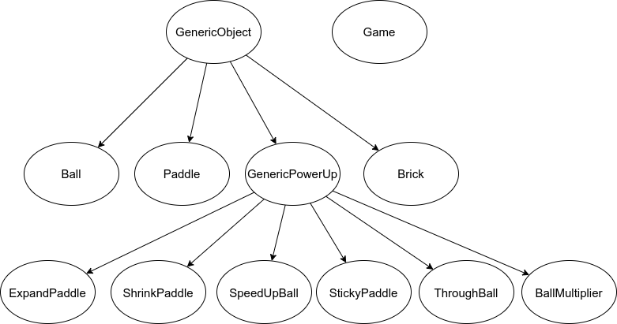

## Introduction

The player will be using a paddle with a bouncing ball to smash a
wall of bricks and make high scores! The objective of the game is to break all the bricks as fast as possible and
beat the highest score! You lose a life and all the powerups gained when the ball touches the ground below the paddle.


## Setup

---

Ensure that you have python3.6+ and pip installed.

```(shell)
pip install -r requirements.txt
```

Run the following to play the game

```(shell)
python3 main.py
```
## How to play?
---
### Controls

- <kbd>A</kbd>: To move the paddle left
- <kbd>D</kbd>: To move the paddle right
- <kbd>SPACE</kbd>: To release the ball from the paddle
- <kbd>a</kbd>: To quit game

*Note: The controls are force-based. No need to press them continuously to achieve motion.

### Gameplay

Collect powerups, and destroy bricks to increase your score. But beware of some powerup as they might increase the ball speed or shrink your paddle!

Press <kbd>A</kbd> and <kbd>D</kbd> for movement and try to save the ball from falling into the abyss. Also press <kbd>space</kbd> to release a new ball or when `sticky paddle` powerup is active at whichever position you like.

Score the highest points by breaking all the bricks (even the unbreakable ones!)

## Object Oriented Concepts

---

Here's a list of instances of the OOPS concepts in use:

### Inheritance

The `ball`, `brick`, `paddle`, `GenericPowerUp`,  classes inherit from `generic` class.

### Polymorphism

The `activate_power_up()` method defined in `GenericPowerUp` class has been overridden in the different classes `ExpandPaddle`, `ShrinkPaddle`, `SpeedUpBall`, `StickyPaddle`, `ThroughBall`, `BallMultiplier`. This example of method overriding represents polymorphism.

### Encapsulation

The entire game is modelled using classes and objects which encapsulate logically different entities.

### Abstraction

Methods like `activate_power_up()`, `_initialize_bricks`, `_draw`, `_terminate`, `_handle_input`, `_detect_brick_ball_collision` abstract away the details and make the code more readable and organised.

### Class structure

